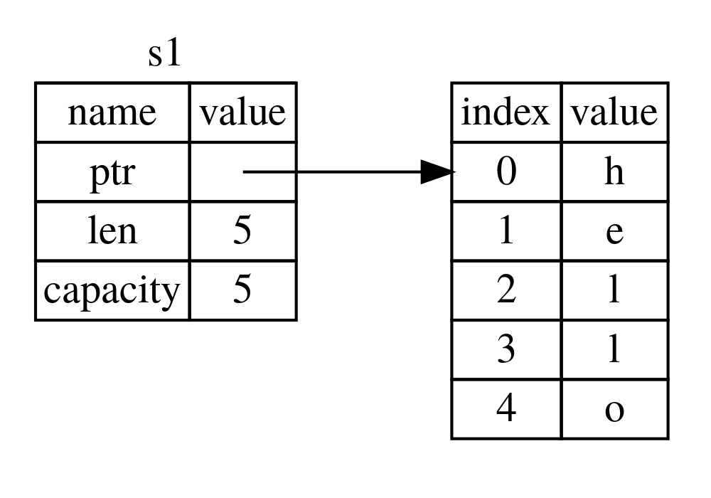
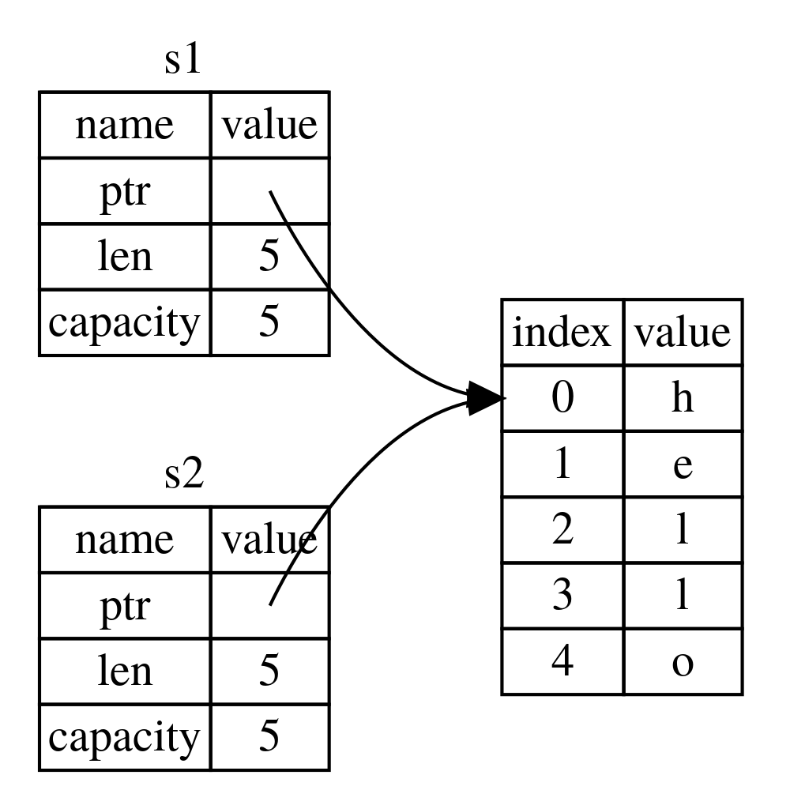
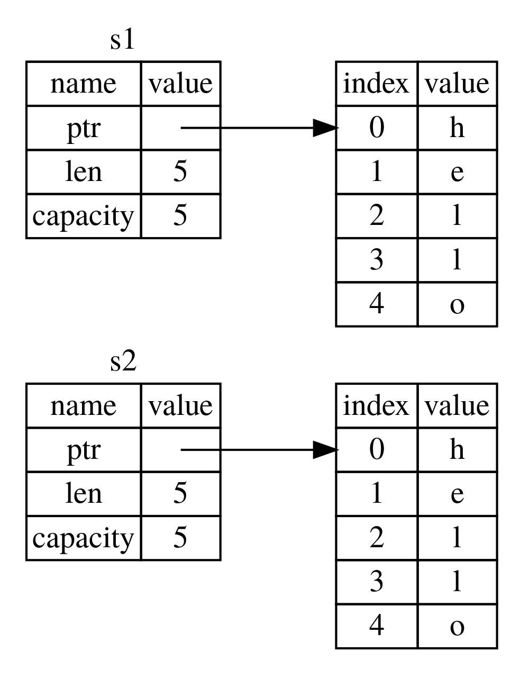
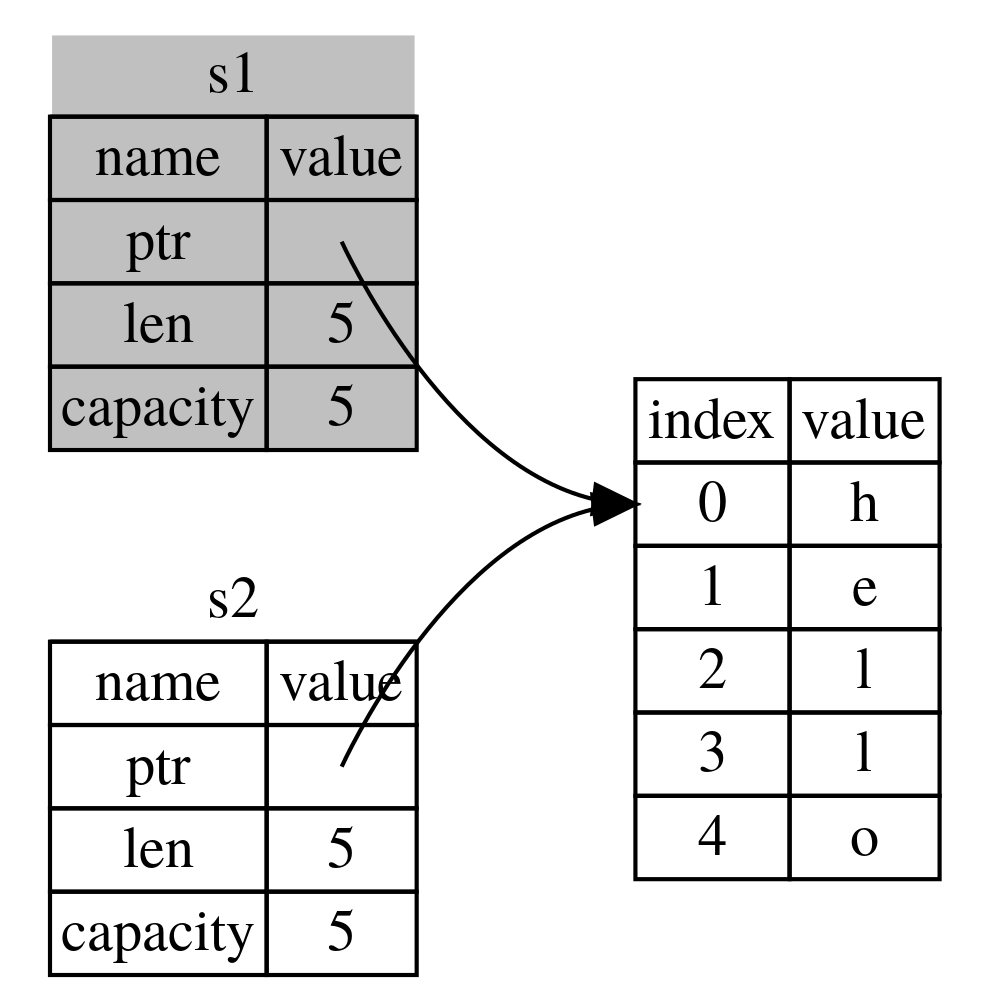

# 所有权是什么？

所有权是 Rust 的核心特性之一。尽管该特性本身很直白且易于解释，但是它对 Rust 的影响十分深刻。

所有程序在运行时都必须对使用计算机内存的方式进行管理。有些语言具有垃圾回收机制，会在运行时不断搜索不再需要的内存；而另一些语言则要求开发者必须在代码中明确内存的分配和释放。Rust 则使用了第三种方式：由所有权系统通过一系列规则管理内存，编译器会在编译时对这些规则进行检查。而所有的所有权特性都不会让程序运行速度变慢。

由于对于很多开发者来说，所有权都是一个全新的概念，因此也需要一些时间来适应。而好消息是，你越熟悉 Rust 和所有权系统的规则，你就越能自然而然的写出安全高效的代码。跟上节奏，继续学习！

一旦理解了所有权，也就获得了理解 Rust 特性的坚实基础，而正是这些特定让 Rust 独一无二。本章中我们将通过完成一些代码示例来学习所有权，这些例子都基于一个很常见的数据结构：String。

> ## 栈（Stack）和堆（Heap）
> 
> 在很多其他编程语言中，我们不必经常考虑到堆栈。而在像 Rust 这种系统编程语言中，值是保存在栈还是堆中会更大程度的影响编程语言的行为和作出某些决策的原因。本章的后续内容涉及和堆栈相关的部分所有权，因而在这里我们先做一个简短的介绍。
> 
> 堆和栈都是代码运行时可以使用的内存块，但是它们的结构不同。栈按顺序存储获取到的值，但以相反的顺序移出。也被称为后进先出。想象这里有一叠盘子：当需要放入新的盘子时，我们把它放在顶端，而当需要使用盘子时，也从顶端拿走。从中间或者底部放入或取走盘子都不可行！增加数据称为进栈，而移出数据则称为出栈。
> 
> 所有存储在栈中的数据的大小必须已知且固定。而编译时未知大小或者可能变化的数据则必须存储在堆中。堆的组织更弱化一些：当我们向堆中增加数据时，需要请求一个特定大小的空间。操作系统会在堆中找到一段足够大的空位，将其标记为已占用，并返回指向该地址的指针。这个过程称为分配堆内存，有时直接简称为分配。进栈操作不属于分配。而由于指针的大小是已知且固定的，我们可以将指针存储在栈中，当时当我们想要访问实际数据时，则必须访问指针所指向的内存。
> 
> 想象一下去餐厅就座用餐的过程。你进入餐厅，说明就餐人数，服务员会为你找一个足够大的空桌并把你领到桌子旁。如果有人来晚了，他可以询问座位在哪里并找到你们。
> 
> 进栈操作比分配堆内存要快，因为进栈时，操作系统不需搜索用来容纳新数据的内存空间；新数据直接放在栈顶即可。而相比而言，分配堆内存则需要更多工作，因为操作系统必须首先找到足以容纳数据的空间，并记录数据，好为下一次分配作准备。
> 
> 读取堆数据比读取栈数据慢，因为读取堆数据必须通过指针。而跳跃的内存越少，当代处理器的速度就越快。我们再打个比方，假设某个餐厅服务员同时负责多桌的点餐。最高效的方式是拿到某一桌所有订单后再去下一桌。而从 A 桌拿到一份点餐单，然后去 B 桌拿，接着再回到 A，然后再去 B，这一流程就比较慢。同理，处理器处理距离近的数据（例如栈中的数据）要比较远的时候（例如堆中的数据）更能更好的完成任务。在堆上分配大量的空间也十分耗时。
> 
> 当代码调用某个函数时，传入该函数的值（包括可能指向堆中数据的指针）和函数内局部变量将会被压入栈中。函数结束时，这些值会从栈中移出。
> 
> 追踪哪些代码使用了堆上哪些数据，尽可能减少堆中的重复数据，及时清理堆上无用的数据以免空间耗尽，这些都是所有权系统要处理的问题。一旦你理解了所有权，就不需要总是考虑堆和栈了，但是搞清楚所有权可以管理堆数据，能帮助解释为何所有权要以这种方式工作。

## 所有权规则

首先，我们一起来看看所有权规则。在我们学习下文中的说明示例时，请牢记这些规则：

* Rust 中所有的值都有一个被称为其所有者的变量。
* 每一时刻该值只能有一个所有者。
* 如果所有者离开作用域，这个值就会被丢弃。

## 变量作用域

在第二章中，我们已经学习过一个 Rust 程序示例。现在我们也已经学过了基础语法，那么在下面的示例中，将不再包含 `fn main() {` 代码，因此如果你想要仿照示例练习，请记得将代码放入 `main` 函数中。这样代码示例将更加简洁，我们就能更加专注于代码细节，而不是模版代码。

在所有权学习的第一个例子中，我们先了解变量作用域。作用域指项（item）在程序中有效的范围。假设有这样一个变量：

```rs
let s = "hello";
```

变量 `s` 绑定了一个字符串字面量，字符串的值硬编码在程序文本中。从变量声明到当前作用域止，其间变量是有效的。代码示例 4-1 的注释中指出了变量 `s` 有效的范围。

```rs
{                      // 这里 s 无效，此时 s 还未声明
    let s = "hello";   // s 从这里开始有效

    // 可以对 s 进行操作
}                      // 作用域结束，s 无效
```
代码示例 4-1：变量及其作用域

换言之，两个非常重要的时间点：

* 当 `s` 进入作用域，它就是有效的。
* 有效的状态持续到离开作用域为止。

在这一点，作用域和变量是否有效的关系与其他语言是类似的。在理解了这一点的基础上，我们继续介绍 `String` 类型。

## `String` 类型

为了说明所有权规则，我们需要一个比第三章“数据类型”章节里更复杂一些的数据类型。我们之前学过的类型都存储在栈中，作用域结束它们就会出栈，但我们希望能存在堆上的数据，并探索 Rust 是如何知道何时清理这些数据的。

我们将使用 `String` 作为示例，并专注于 `String` 和所有权相关的部分。这些方面同样可以应用于其他复杂的数据类型，不管这些类型是由标准库或者开发者提供的。在第八章我们将更深入的探讨 `String`。

我们已经看到过字符串字面量，字符串值是硬编码在程序中。字符串字面量使用方便，但是并不适用于所有使用文字的场景。其中一个原因即它们是不可更改的。另一个是，并不是所有字符串值在写代码的时候都是已知的：例如，如果你想要获取用户输入并存储呢？为了适配这些场景，Rust 提供了第二种字符串类型：`String`。该类型在堆中分配内存，所以可以存储编译时未知大小的文本。我们可以使用 `from` 函数，并基于字符串字面量创建 `String`，如下所示：

```rs
let s = String::from("hello");
```

操作符双冒号（`::`）可以将特定的 `from` 函数置于 `String` 类型的命名空间下，而避免了使用像 `string_from` 这样的名字。我们在第五章的“方法语法”中会更详尽探讨这种双冒号语法，并在第七章的“引用模块树中项的路径”中讨论模块和命名空间。

这种类型的字符串可被修改：

```rs
let mut s = String::from("hello");

s.push_str(", world!"); // push_str() 为 String 增加了一段字面量

println!("{}", s); // 将会打印出 `hello, world!`
```

这和之前的方式有何不同呢？为什么 `String` 可以被修改而字面量不能？区别在于，两种类型处理内存的方式不同。

## 内存和分配

如果我们使用字符串字面量，编译时该字符串内容已知，于是这段文本就会被直接硬编码到最后的可执行文件中。这也是字符串字面量快捷高效的原因。但这种优势只得益于字符串字面量的不可变性。然而我们不能为每一段编译时大小未知、运行时大小可变的字符串，而将一段内存编码进二进制文件中。

为了支持内容可变、体积可增长的文本，可以使用 `String` 类型，此时我们需要在堆上分配一块编译时大小未知的内存来保存内容。这意味着：

* 必须在运行时向系统请求内存。
* `String` 类型使用完毕后，需要有将内存返还给操作系统的方式。

第一部分由开发者完成：当调用 `String::from` 时，方法执行就会请求它需要的内存。这种方式在编程语言中很常见。

但是，第二部分就不同了。在有垃圾回收（garbage collector，即 GC）的语言中，GC 会追踪并清理不再需要的内存，我们无需多虑。而对于那些没有 GC 的语言，开发者就有责任指明那些无用的内存并调用某些代码将其显式的归还，正如我们请求内存那样。正确的完成这一步一直以来都是个编程难题。如果忘记了就会浪费内存；而如果过早释放，就无法获取有效的变量值；如果释放了两次，同样会导致问题。对每次内存分配，必须精确匹配一次释放。

而 Rust 另辟蹊径：一旦变量离开作用域，内存就会被自动回收。如下是将作用域代码示例 4-1 中的字符串字面量换成了 `String` 的版本：

```rs
{
    let s = String::from("hello"); // s 从这里开始有效

    // 可以对 s 进行操作
}                                  // 作用域结束，s 无效
```

当 `s` 离开作用域，我们就很自然的将 `String` 所需的内存返还给操作系统。当变量离开作用域，Rust 会为我们调用一个特殊的函数，即 `drop`，`String` 类型的开发者可以在这里放置返还内存的代码。Rust 会在结尾的花括号处自动调用 `drop`。

> 注：在 C++ 中，这种在项的生命周期结束时回收资源的模式优势也被称为资源获取即初始化（Resource Acquisition Is Initialization，RAII）。如果你使用过 RAII 模式，那么对 Rust 中的 `drop` 函数也就并不陌生。

这种模式对书写 Rust 代码的方式有深刻的影响。也许现在看上去还简单，但是在相对复杂的场景下，代码行为可能会变得不可预测，例如我们希望大量变量去使用分配在堆内存的数据。现在我们就探讨一些这种复杂场景。

### 变量和数据的交互方式：移动

在 Rust 中，多个变量可以以不同方式与同一数据进行交互。我们来看如下使用整数的代码示例 4-2：

```rs
let x = 5;
let y = x;
```

代码示例 4-2：将变量 `x` 的整数值赋值给 `y`

我们可以大致猜测这段代码做了什么：“将 `5` 绑定到 `x`；复制 `x` 的值然后再绑定到 `y`。”现在我们得到了两个变量，`x` 和 `y`，它们的值都是 `5`。事实确实如此，而由于整数是简单值，它已知且大小固定，这两个数值 `5` 都被压入栈中。

现在我们再看看使用 `String` 类型的版本：

```rs
let s1 = String::from("hello");
let s2 = s1;
```

这段代码和前面的非常相似，因此我们可能会假设两段代码的运行模式是一致的：即第二行代码会复制 `s1` 的值并赋值给 `s2`。但事实并非如此。

如图 4-1，我们来看看使用 `String` 时到底发生了什么。图片左侧表示 `String` 类型的数据由三部分组成：指向存储字符串内存的指针，长度，和容量。这一组数据在栈中保存。图右侧表示堆中保存字符串内容的内存。



图 4-1：将值 `"hello"` 绑定给 `s1` 的 `String` 内存示意图

长度表示 `String` 中的内容目前在内存中占用的比特。容量表示 `String` 从操作系统中获取到的所有内存的比特总量。长度和容量之前的区别非常重要，但本章中不会涉及，目前我们可以先忽略容量这个概念。

当我们将 `s1` 赋值给 `s2`，`String` 的数据也同时被复制，即复制存储在栈中的指针、长度和容量数据。但是指针指向的堆上的数据则不会被复制。此时内存中数据如图 4-2 所示。



图 4-2：拷贝了 `s1` 的指针、长度和容量后 `s2` 的内存示意图

这和图 4-3 不同，图 4-3 表示了如果 Rust 也复制堆数据时的内存应该是什么样子。而如果 Rust 真的这么做了，那么当堆中的数据量很大时，操作 `s2 = s1` 就会对性能造成很大的影响。



图 4-3：如果 Rust 也拷贝堆中数据，那么操作 `s2 = s1` 时可能的内存示意图

前文中我们说过，如果变量离开作用域，Rust 就会自动调用 `drop` 函数清理该变量的堆内存。但如图 4-2，两个数据指针指向了同一地址。那么问题是，当 `s2` 和 `s1` 离开作用域时，它们两个都会试图释放相同一段内存。这个错误被称为二次释放，也是之前提到过的内存安全性问题之一。二次释放同一内存可能导致内存污染，而内存污染可能导致安全漏洞。

为了确保内存安全，这种场景下 Rust 还会处理另一个细节。与其尝试拷贝被分配的内存，Rust 会认为 `s1` 不再有效，因此 `s1` 离开作用域时就不需要任何释放内存的操作。可以尝试在 `s2` 创建后使用 `s1`，看看会发生什么；代码是无法运行的：

这段代码无法编译！
```rs
let s1 = String::from("hello");
let s2 = s1;

println!("{}, world!", s1);
```

代码将会报错，如下所示，因为此时 Rust 会阻止你使用无效的引用：

```sh
error[E0382]: use of moved value: `s1`
 --> src/main.rs:5:28
  |
3 |     let s2 = s1;
  |         -- value moved here
4 |
5 |     println!("{}, world!", s1);
  |                            ^^ value used here after move
  |
  = note: move occurs because `s1` has type `std::string::String`, which does
  not implement the `Copy` trait
```

如果你在其他语言的使用中听过浅拷贝和深拷贝，那么你可能觉得拷贝指针、长度和容量而不拷贝数据这样的概念可能和浅拷贝很相似。但是由于 Rust 同时也将第一个变量置为无效，因此我们将其称为移动，而非浅拷贝。这个例子中，我们称 `s1` 被移动到了 `s2`。具体发生了什么，如图 4-4 所示：



图 4-4：`s1` 无效后内存示意图

这就解决了我们刚才的问题！由于只有 `s2` 有效，当其离开作用域后，就只会释放它的内存，然后完成。

另外，这里还隐含了一个语言设计上的选择：Rust 永远不会自动创建数据的深拷贝。因此，我们可以认为任何自动完成的拷贝都不会对运行时性能造成大的影响。

### 变量和数据的交互方式：克隆

如果我们确实想要深拷贝 `String` 在堆中的数据，而不仅仅拷贝栈中数据，我们可以使用一个名为 `clone` 的通用方法。我们将会在第五章讨论该方法的语法，不过因为该方法是很多编程语言中的通用特性，你之前说不定已经见过了。

这是一个实际使用 `clone` 方法的例子：

```rs
let s1 = String::from("hello");
let s2 = s1.clone();

println!("s1 = {}, s2 = {}", s1, s2);
```

这段代码可以正常运行，并且精准完成了如图 4-3 所示的操作，拷贝了堆上的数据。

当出现 `clone` 的调用时，我们就知道某些可能很耗费性能的代码会被执行。这是一个显示指示，告诉你不同寻常的事情将要发生。

### 只存储于栈中数据的拷贝

这里还有一个我们没讨论到的细节。如下代码使用了整型，其中一部分我们在示例 4-2 中见过了，此时变量均有效，且代码可以正常运行：

```rs
let x = 5;
let y = x;

println!("x = {}, y = {}", x, y);
```

但是这段代码似乎和我们刚学过的知识冲突了：我们并没有调用 `clone`，但是 `x` 依旧有效，没有被移动到 `y`。

这种现象的原因是，如整型这样编译时大小已知的类型，会被完全存储在栈中，因此复制其实际值能够很快捷的完成。这意味着，我们没理由期望在变量 `y` 创建后将 `x` 置为无效。即，此时深拷贝和浅拷贝是没有区别的，此时调用 `clone` 的效果和浅拷贝一样，我们这样写就可以了。

Rust 还有一种名为 `Copy` trait 的特殊注解，我们可以将其用于像整型这样存储于栈中的数据上（我们会在第十章详细讨论）。如果某类型获得 `Copy` trait 注解，那么旧的变量在赋值操作进行后可以保持有效。Rust 不允许开发者为自身或其任何部分实现了 `Drop` trait 的类型使用 `Copy` trait。如果某类型需要在其值离开作用域时完成某些特殊处理，而我们为该类型添加了 `Copy` 注解，代码编译将会报错。如果想要学习如何为类型添加 `Copy` 注解，可以参见附录 C “可派生 trait”。

因此哪些类型是可 `Copy` 的呢？当然我们可以通过查询文档来确认，但是一般来说，简单标量值都是可 `Copy` 的，以及不需要分配内存或其他形式资源的类型也是可 `Copy` 的。如下是一些可 `Copy` 的类型：

* 所有的整数类型，例如 `u32`。
* 布尔类型 `bool`，其值为 `true` 或 `false`。
* 所有的浮点类型，例如 `f64`。
* 字符类型 `char`。
* 只包含可 `Copy` 类型的元组。例如 `(i32, i32)` 是可以的，但是 `(i32, String)` 不可。

## Ownership and Functions
## 所有权与函数

The semantics for passing a value to a function are similar to those for assigning a value to a variable. Passing a variable to a function will move or copy, just as assignment does. Listing 4-3 has an example with some annotations showing where variables go into and out of scope.

Filename: src/main.rs

```rs
fn main() {
    let s = String::from("hello");  // s comes into scope

    takes_ownership(s);             // s's value moves into the function...
                                    // ... and so is no longer valid here

    let x = 5;                      // x comes into scope

    makes_copy(x);                  // x would move into the function,
                                    // but i32 is Copy, so it’s okay to still
                                    // use x afterward

} // Here, x goes out of scope, then s. But because s's value was moved, nothing
  // special happens.

fn takes_ownership(some_string: String) { // some_string comes into scope
    println!("{}", some_string);
} // Here, some_string goes out of scope and `drop` is called. The backing
  // memory is freed.

fn makes_copy(some_integer: i32) { // some_integer comes into scope
    println!("{}", some_integer);
} // Here, some_integer goes out of scope. Nothing special happens.
```

Listing 4-3: Functions with ownership and scope annotated

If we tried to use `s` after the call to `takes_ownership`, Rust would throw a compile-time error. These static checks protect us from mistakes. Try adding code to `main` that uses `s` and `x` to see where you can use them and where the ownership rules prevent you from doing so.

### Return Values and Scope

Returning values can also transfer ownership. Listing 4-4 is an example with similar annotations to those in Listing 4-3.

Filename: src/main.rs

```rs
fn main() {
    let s1 = gives_ownership();         // gives_ownership moves its return
                                        // value into s1

    let s2 = String::from("hello");     // s2 comes into scope

    let s3 = takes_and_gives_back(s2);  // s2 is moved into
                                        // takes_and_gives_back, which also
                                        // moves its return value into s3
} // Here, s3 goes out of scope and is dropped. s2 goes out of scope but was
  // moved, so nothing happens. s1 goes out of scope and is dropped.

fn gives_ownership() -> String {             // gives_ownership will move its
                                             // return value into the function
                                             // that calls it

    let some_string = String::from("hello"); // some_string comes into scope

    some_string                              // some_string is returned and
                                             // moves out to the calling
                                             // function
}

// takes_and_gives_back will take a String and return one
fn takes_and_gives_back(a_string: String) -> String { // a_string comes into
                                                      // scope

    a_string  // a_string is returned and moves out to the calling function
}
```

Listing 4-4: Transferring ownership of return values

The ownership of a variable follows the same pattern every time: assigning a value to another variable moves it. When a variable that includes data on the heap goes out of scope, the value will be cleaned up by `drop` unless the data has been moved to be owned by another variable.

Taking ownership and then returning ownership with every function is a bit tedious. What if we want to let a function use a value but not take ownership? It’s quite annoying that anything we pass in also needs to be passed back if we want to use it again, in addition to any data resulting from the body of the function that we might want to return as well.

It’s possible to return multiple values using a tuple, as shown in Listing 4-5.

Filename: src/main.rs

```rs
fn main() {
    let s1 = String::from("hello");

    let (s2, len) = calculate_length(s1);

    println!("The length of '{}' is {}.", s2, len);
}

fn calculate_length(s: String) -> (String, usize) {
    let length = s.len(); // len() returns the length of a String

    (s, length)
}
```
Listing 4-5: Returning ownership of parameters

But this is too much ceremony and a lot of work for a concept that should be common. Luckily for us, Rust has a feature for this concept, called references.
