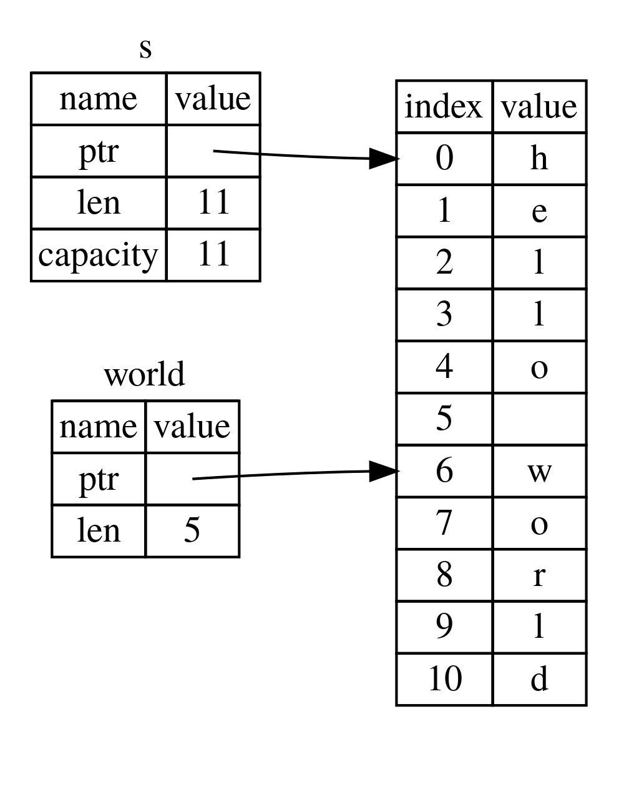

# slice 类型

另一种没有所有权的类型是 slice。slice 可以引用集合中某个连续的集合序列，而非整个集合。

我们来看一道编程小题：要求写一个函数，该函数接收一个字符串，并返回该字符串中的第一个单词。而如果字符串中没有空格，就认为整个字符串就是一个单词，此时返回整个字符串即可。

首先我们先想想函数签名应该怎么写：

```rs
fn first_word(s: &String) -> ?
```

函数 `first_word` 参数为 `&String` 类型。我们并不需要所有权，这样写没问题。那么我们应该返回什么呢？我们还没有正式讨论过字符串片段，不过我们可以先返回第一个单词末尾的索引。试试看示例 4-7 的代码：

文件名：src/main.rs

```rs
fn first_word(s: &String) -> usize {
    let bytes = s.as_bytes();

    for (i, &item) in bytes.iter().enumerate() {
        if item == b' ' {
            return i;
        }
    }

    s.len()
}
```

代码示例 4-7：函数 `first_word` 会返回 `String` 参数中的某一字节的索引值

因为我们需要审查 `String` 中的每一个元素，并确认其是否为空格，因此我们使用 `as_bytes` 方法将 `String` 转化为一个字节数组：

```rs
let bytes = s.as_bytes();
```

下面我们使用 `iter` 方法在该字节数组上创建一个迭代器：

```rs
for (i, &item) in bytes.iter().enumerate() {
```

我们将会在第十三章详细讨论迭代器。现在我们只需要知道 `iter` 方法会返回一个包含所有元素的集合，`enumerate` 则会包装 `iter` 返回的结果，将每个元素包裹在元组中。元组中第一个元素是索引，第二个则是元素的引用。这比我们自己计算索引要方便的多。

我们可以使用模式解构 `enumerate` 方法返回得元组。在 `for` 循环中，定义模式中的 `i` 表示元组中的索引，`&item` 表示元组中的单个字节。而因为我们从 `.iter().enumerate()` 得到的是元素的引用，因而在模式中也要使用 `&` 符号。

在 `for` 循环中，我们使用字节字面值语法来搜索表示空格的字节。如果找到了，就返回空格的位置信息。否则就使用 `s.len()` 返回字符串的长度：

```rs
    if item == b' ' {
        return i;
    }
}

s.len()
```

现在我们有办法找到字符串中第一个单词结尾的索引了，但是仍旧存在一个问题。我们只返回了 `usize` 数据本身，但它仅在 `&String` 数据的上下文中才是个有意义的数字。也就是，由于这个数字和 `String` 是分离的，那么我们无法保证未来这个数字依旧有效。我们来看代码示例 4-8 的程序，它使用了 4-7 中的 `first_word` 函数。

文件名：src/main.rs

```rs
fn main() {
    let mut s = String::from("hello world");

    let word = first_word(&s); // word 的值是 5

    s.clear(); // 这行代码将 String 清空了，现在字符串等于 ""

    // 而 word 的值依旧是 5，但是字符串已经不存在了
    // 也就没有我们可以有效应用 5 的地方了。word 现在已经完全无效了！
}
```

代码示例 4-8：存储 `first_word` 函数返回的结果然后修改了 `String` 的内容

程序编译没有任何问题，并且在调用 `s.clear()` 后我们依旧可以使用 `word`。因为 `word` 和 `s` 的状态没有任何关联，其值依旧是 `5`。我们也依旧可以使用 `5` 来尝试提取出 `s` 的第一个单词，但这就会导致问题了，因为 `s` 的内容已经在将 `5` 保存至 `word` 后改变了。

我们不得不担心 `word` 保存的索引和 `s` 的数据不同步是数据冗余且容易出错的！而如果我们再写一个 `second_word` 函数来管理这些索引的逻辑甚至更加脆弱。它的函数签名如下：

```rs
fn second_word(s: &String) -> (usize, usize) {
```

这次我们追踪的是单词起始和结束的索引，我们对于数据某个特殊状态计算得出的结果更多了，但它们都没有和状态绑定。现在我们有三个相互并不关联的变量，而我们需要让它们保持同步。

幸运的是，Rust 对此类问题提供了解决方案：字符串 slice。

## 字符串 slice

字符串 slice 是 `String` 的部分的引用，如下所示：

```rs
let s = String::from("hello world");

let hello = &s[0..5];
let world = &s[6..11];
```

这种方式和获取完整 `String` 的引用类似，但却还带有额外的 `[0..5]` 部分。它获取得不是整个 `String` 的引用，而是部分的引用。

我们使用方括号 `[starting_index..ending_index]` 的形式创建 slices，`starting_index` 是 slice 的起始位置，`ending_index` 是 slice 终止位置的下一个索引。在引用内，slice 数据结构保存了起始位置和 slice 的长度，即 `ending_index` 减去 `starting_index` 的值。所以例如 `let world = &s[6..11];`，`world` 是一个包含了指向 `s` 第 7 个（从 1 开始计算）字节的指针，并且长度值是 5 的 slice。

如图 4-6 所示。



图 4-6：引用部分 `String` 的字符串 slice

With Rust’s `..` range syntax, if you want to start at the first index (zero), you can drop the value before the two periods. In other words, these are equal:

```rs
let s = String::from("hello");

let slice = &s[0..2];
let slice = &s[..2];
```

By the same token, if your slice includes the last byte of the `String`, you can drop the trailing number. That means these are equal:

```rs
let s = String::from("hello");

let len = s.len();

let slice = &s[3..len];
let slice = &s[3..];
```

You can also drop both values to take a slice of the entire string. So these are equal:

```rs
let s = String::from("hello");

let len = s.len();

let slice = &s[0..len];
let slice = &s[..];
```

> Note: String slice range indices must occur at valid UTF-8 character boundaries. If you attempt to create a string slice in the middle of a multibyte character, your program will exit with an error. For the purposes of introducing string slices, we are assuming ASCII only in this section; a more thorough discussion of UTF-8 handling is in the “Storing UTF-8 Encoded Text with Strings” section of Chapter 8.

With all this information in mind, let’s rewrite `first_word` to return a slice. The type that signifies “string slice” is written as `&str`:

文件名：src/main.rs

```rs
fn first_word(s: &String) -> &str {
    let bytes = s.as_bytes();

    for (i, &item) in bytes.iter().enumerate() {
        if item == b' ' {
            return &s[0..i];
        }
    }

    &s[..]
}
```

We get the index for the end of the word in the same way as we did in Listing 4-7, by looking for the first occurrence of a space. When we find a space, we return a string slice using the start of the string and the index of the space as the starting and ending indices.

Now when we call `first_word`, we get back a single value that is tied to the underlying data. The value is made up of a reference to the starting point of the slice and the number of elements in the slice.

Returning a slice would also work for a `second_word` function:

```rs
fn second_word(s: &String) -> &str {
```

We now have a straightforward API that’s much harder to mess up, because the compiler will ensure the references into the `String` remain valid. Remember the bug in the program in Listing 4-8, when we got the index to the end of the first word but then cleared the string so our index was invalid? That code was logically incorrect but didn’t show any immediate errors. The problems would show up later if we kept trying to use the first word index with an emptied string. Slices make this bug impossible and let us know we have a problem with our code much sooner. Using the slice version of `first_word` will throw a compile-time error:

文件名：src/main.rs

This code does not compile!

```rs
fn main() {
    let mut s = String::from("hello world");

    let word = first_word(&s);

    s.clear(); // error!

    println!("the first word is: {}", word);
}
```

Here’s the compiler error:

```sh
error[E0502]: cannot borrow `s` as mutable because it is also borrowed as immutable
  --> src/main.rs:18:5
   |
16 |     let word = first_word(&s);
   |                           -- immutable borrow occurs here
17 |
18 |     s.clear(); // error!
   |     ^^^^^^^^^ mutable borrow occurs here
19 |
20 |     println!("the first word is: {}", word);
   |                                       ---- immutable borrow later used here
```

Recall from the borrowing rules that if we have an immutable reference to something, we cannot also take a mutable reference. Because `clear` needs to truncate the `String`, it needs to get a mutable reference. Rust disallows this, and compilation fails. Not only has Rust made our API easier to use, but it has also eliminated an entire class of errors at compile time!

### String Literals Are Slices

Recall that we talked about string literals being stored inside the binary. Now that we know about slices, we can properly understand string literals:

```rs
let s = "Hello, world!";
```

The type of `s` here is `&str`: it’s a slice pointing to that specific point of the binary. This is also why string literals are immutable; `&str` is an immutable reference.

### String Slices as Parameters

Knowing that you can take slices of literals and `String` values leads us to one more improvement on `first_word`, and that’s its signature:

```rs
fn first_word(s: &String) -> &str {
```

A more experienced Rustacean would write the signature shown in Listing 4-9 instead because it allows us to use the same function on both `&String` values and `&str` values.

```rs
fn first_word(s: &str) -> &str {
```

Listing 4-9: Improving the `first_word` function by using a string slice for the type of the `s` parameter

If we have a string slice, we can pass that directly. If we have a `String`, we can pass a slice of the entire `String`. Defining a function to take a `string` slice instead of a reference to a String makes our API more general and useful without losing any functionality:

文件名：src/main.rs

```rs
fn main() {
    let my_string = String::from("hello world");

    // first_word works on slices of `String`s
    let word = first_word(&my_string[..]);

    let my_string_literal = "hello world";

    // first_word works on slices of string literals
    let word = first_word(&my_string_literal[..]);

    // Because string literals *are* string slices already,
    // this works too, without the slice syntax!
    let word = first_word(my_string_literal);
}
```

## Other Slices

String slices, as you might imagine, are specific to strings. But there’s a more general slice type, too. Consider this array:

```rs
let a = [1, 2, 3, 4, 5];
```

Just as we might want to refer to a part of a string, we might want to refer to part of an array. We’d do so like this:

```ts
let a = [1, 2, 3, 4, 5];

let slice = &a[1..3];
```

This slice has the type `&[i32]`. It works the same way as string slices do, by storing a reference to the first element and a length. You’ll use this kind of slice for all sorts of other collections. We’ll discuss these collections in detail when we talk about vectors in Chapter 8.

## Summary

The concepts of ownership, borrowing, and slices ensure memory safety in Rust programs at compile time. The Rust language gives you control over your memory usage in the same way as other systems programming languages, but having the owner of data automatically clean up that data when the owner goes out of scope means you don’t have to write and debug extra code to get this control.

Ownership affects how lots of other parts of Rust work, so we’ll talk about these concepts further throughout the rest of the book. Let’s move on to Chapter 5 and look at grouping pieces of data together in a `struct`.
